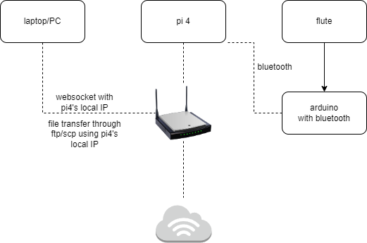

# music-x




## Frontend

- /UI/flute-app
- An React app. Run on laptop connected to network.
- Can add a `/UI/flute-app/.env.development.local` file to specify the backend IP on the local networl.
  - For example `REACT_APP_WEBSOCKET_SERVER=ws://192.168.68.115:8765`
- See /UI/flute-app/README.md for more info.


## Backend

- /UI/server
- A python websocket server. Tested with Python 3.8. Run on raspberry pi 4, or on laptop during development.
- Can specify `/UI/server/.env` with things like
```
WEBSOCKET_IP = '192.168.68.115'
PORT = 8765
LOG_DIR = 'E:\\4_GithubProjects\\music-x\\logs\\experiment'
SERVO_1_CHANNEL = '11'
SERVO_2_CHANNEL = '8'
```
- Things like `SERVO_1_CHANNEL` corresponds to the Servo - PCA9685 driver hat pins mapping.
- The `WEBSOCKET_IP` shall be the IP of the raspberry pi on the local network.
- Involves Bluetooth. Read Bluetooth section.


## "Flute - Head" Motors

- /flute_to_head.py
- This runs on Raspberry Pi 4.
- This is the script that listens to the Bluetooth serial port on RPi, which receives signals from the capacity sensor.
- It then transmits the commands to the servos accordingly.
- Involves Bluetooth. Read Bluetooth section.
- TODO: Check if we need an env file for things like `SERVO_2_CHANNEL` too!


### Bluetooth

- Communication between Capacity sensor and RPi is done through Bluetooth.
- The sets A and B are already paired up. On RPi, run these commands before either running `python flute_to_head.py`, or before running the Backend Websocket server. TODO: Try including these as part of the scripts.


```
# A
sudo rfcomm release all
sudo rfcomm bind 0 00:14:03:05:18:91

# B
sudo rfcomm release all
sudo rfcomm bind 0 00:14:03:05:1A:20
```


### Virtualenvs
- Python virtual environments have been setup on the RPis, and shall be activated before running python scripts on there.


### Examples


```
# First run rfcomm release and bind

# To run the websocket server on RPi
cd ~/music-x-flute
source ./env/bin/activate
cd ~/music-x-flute/UI/server
# If we need to modify any env vars
# sudo nano .env
python run_server.py

# To run the "Flute - Head" script on RPi
cd ~/music-x-flute
source ./env/bin/activate
python flute_to_head.py
```
